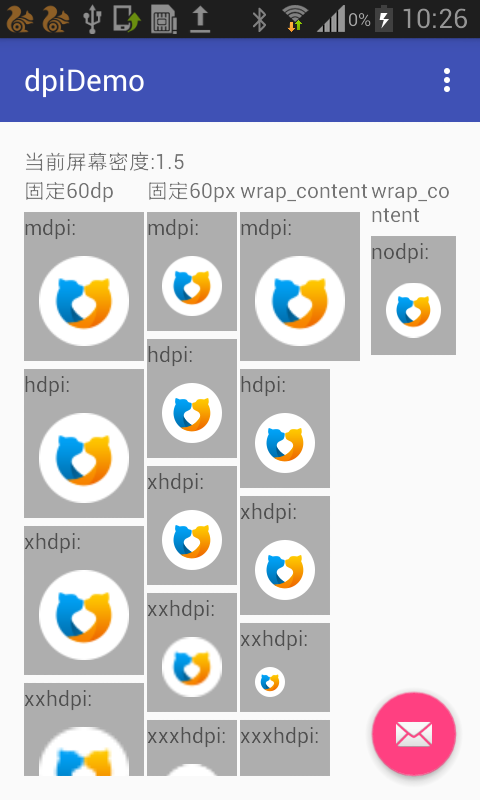
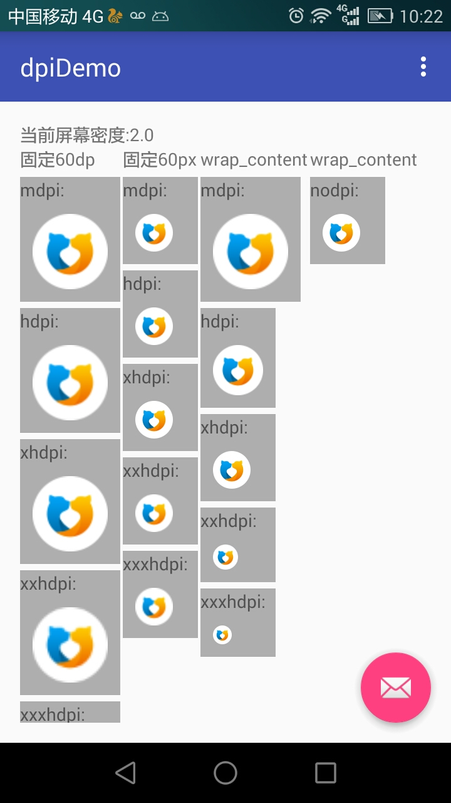
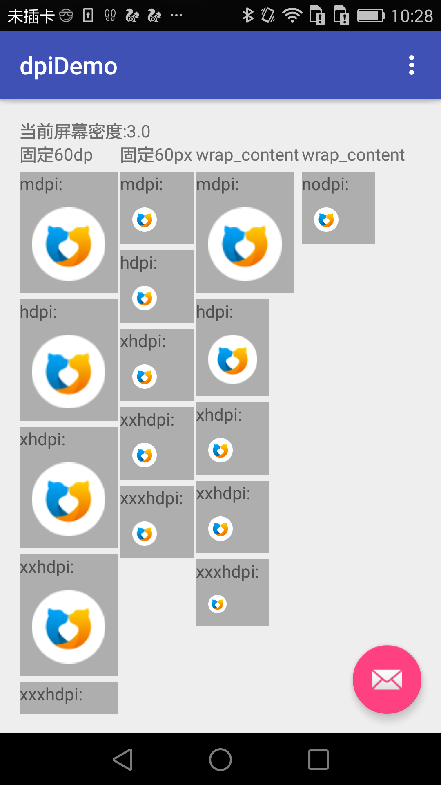

# dpiDemo
一个简单的例子，多角度全方位说明px、dp的关系及分辨率适配
#屏幕尺寸：inch 
屏幕的物理尺寸。衡量标准是屏幕的对角线的长度。
Android设备屏幕尺寸划分为四大类：small，normal，large，extra－large

#分辨率：屏幕上像素（pixel）点总数。
#屏幕密度：density；
单位物理区域内的像素点的个数（dpi），例如如果一台设备屏幕的一物理英寸里面如果有160像素，在这台设备上density＝160 pixel。在安卓系统里面有六种类型：low，medium，high，extra－high，extra－extra－high，extra－extra－extra－high，他们的density分别等于120dpi，160dpi，240dpi，320dpi，480dpi，640dpi，
#独立像素（dp）：
个人觉得谷歌对这个的解释有绕，你可以理解为这个单位和屏幕的density成正比。具体比例：dp＝density／160，所以在low density设备下 1dp＝120/160＝0.75 pixel（反过来1pixel＝1.5dp），在high density设备下 1dp ＝ 240/160 1.5 pixel，以此类推。
 

